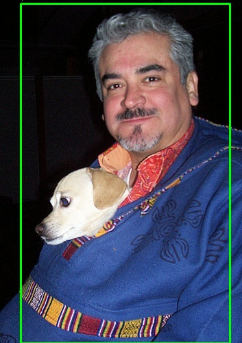
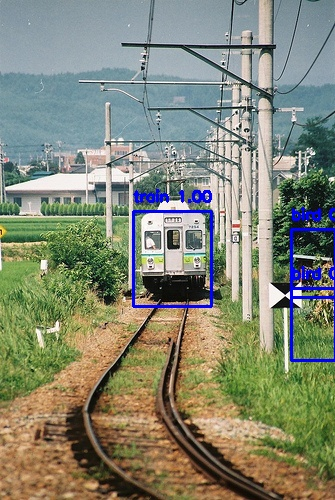
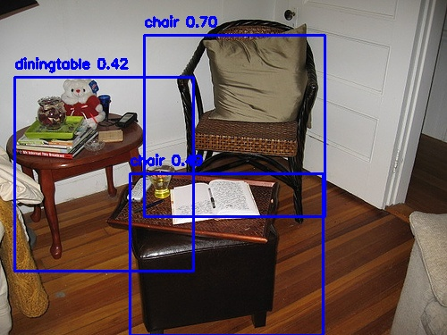
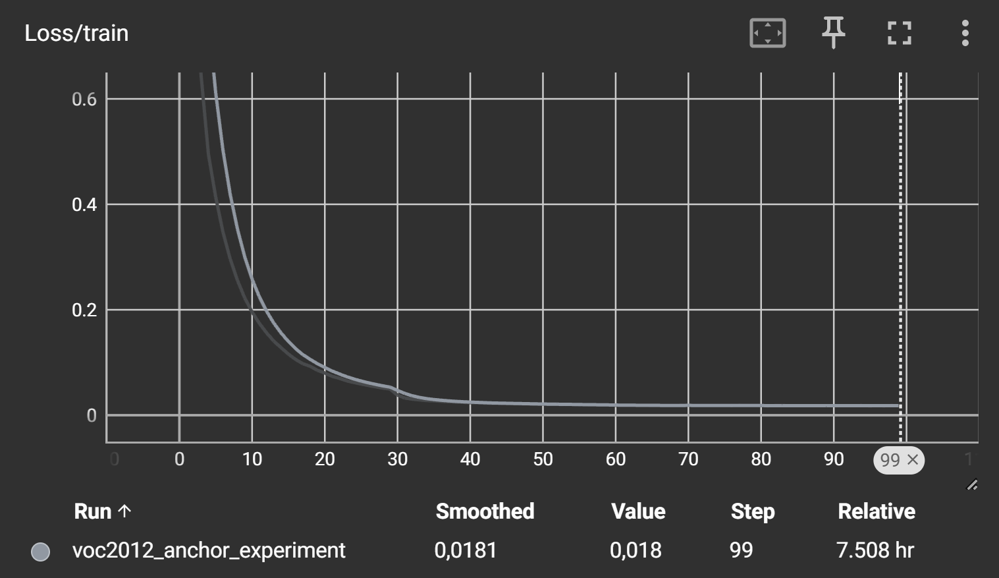
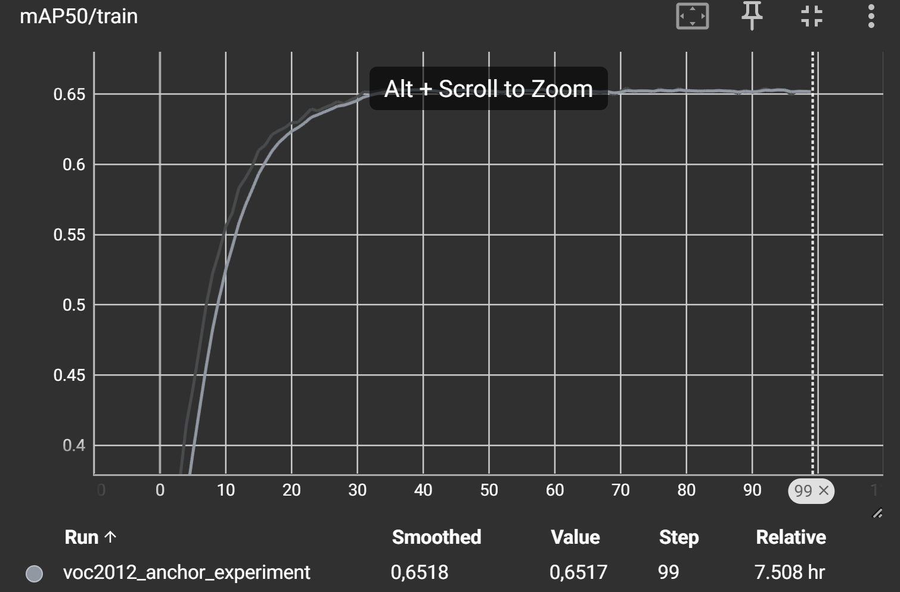
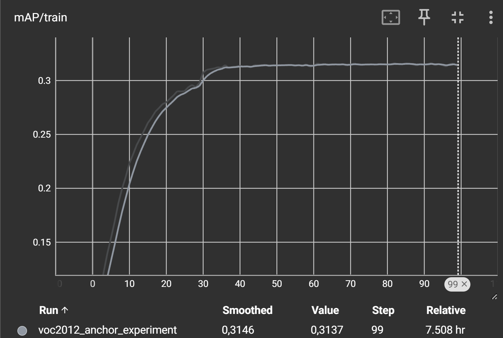

# VOC2012 Object Detection với ResNet-50 + Anchor-Based Detection

Dự án huấn luyện mô hình object detection từ đầu trên tập dữ liệu PASCAL VOC 2012, sử dụng ResNet-50 làm backbone và cơ chế anchor-based detection theo kiến trúc YOLO.

---

## Kết quả

> Thêm ảnh kết quả vào thư mục `results/` và cập nhật bảng bên dưới sau khi train xong.

### Metrics

| Metric | Giá trị |
|--------|---------|
| mAP    | 0.3x |
| mAP@50 | 0.6x |
| Epochs | 100 |

### Ảnh minh họa

<!-- Sau khi train xong, thêm ảnh vào thư mục results/ và uncomment các dòng bên dưới -->


#### Ví dụ detect trên ảnh val





#### Biểu đồ Loss và mAP theo epoch






## Kiến trúc mô hình

```
Input (3 × 224 × 224)
        ↓
  ResNet-50 Backbone
  (pretrained ImageNet, bỏ FC layer)
        ↓
  Feature Map (2048 × 7 × 7)
        ↓
  Detection Head
  Conv2D(2048 → 1024) + BN + LeakyReLU
  Conv2D(1024 → num_anchors × (5 + num_classes))
        ↓
  Output (7 × 7 × 3 anchors × 25)
  [tx, ty, tw, th, conf, class×20]
```

**Anchors (normalize 0–1):**

| Anchor | Width | Height |
|--------|-------|--------|
| Small  | 0.15  | 0.22   |
| Medium | 0.45  | 0.50   |
| Large  | 0.78  | 0.82   |

---

## Cấu trúc thư mục

```
football/
├── src/
│   ├── datasets.py         # VOC2012Dataset
│   └── models.py           # VOC2012Model (ResNet-50 backbone)
├── train.py                # Script huấn luyện chính
├── results/                # Ảnh kết quả, biểu đồ (thêm vào sau khi train)
├── runs/                   # TensorBoard logs
├── voc_resnet50_anchor_last.pt   # Checkpoint mới nhất
├── voc_resnet50_anchor_best.pt   # Checkpoint tốt nhất (theo mAP)
└── README.md
```

---

## Yêu cầu

```bash
pip install torch torchvision torchmetrics tqdm tensorboard
```

| Thư viện | Phiên bản khuyến nghị |
|----------|----------------------|
| torch | >= 2.0 |
| torchvision | >= 0.15 |
| torchmetrics | >= 1.0 |
| tqdm | >= 4.0 |
| tensorboard | >= 2.0 |

---

## Dữ liệu

Dataset: **PASCAL VOC 2012** — 20 classes, ~11,000 ảnh train/val.

Cấu trúc thư mục dữ liệu (YOLO format):

```
D:/football/pascal-voc-2012/
├── train/
│   ├── images/     # ảnh .jpg
│   └── labels/     # annotation .txt (cx cy w h chuẩn hóa 0–1)
└── val/
    ├── images/
    └── labels/
```

**20 classes:**
```
aeroplane, bicycle, bird, boat, bottle, bus, car, cat, chair, cow,
diningtable, dog, horse, motorbike, person, pottedplant, sheep, sofa, train, tvmonitor
```

---

## Huấn luyện

```bash
python train.py
```

Model tự động resume từ `voc_checkpoint_best.pt` nếu file tồn tại.

**Hyperparameters mặc định:**

| Tham số | Giá trị |
|---------|---------|
| Epochs | 100 |
| Batch size | 8 |
| Optimizer | SGD (momentum=0.9, weight_decay=5e-4) |
| Learning rate | 1e-3 |
| LR Scheduler | StepLR (step=30, gamma=0.1) |
| Image size | 224 × 224 |
| Grid size | 7 × 7 |
| Num anchors | 3 |

**Loss weights:**

| Loss | Weight |
|------|--------|
| Box loss | 5.0 |
| Objectness loss (obj) | 1.0 |
| Objectness loss (noobj) | 0.5 |
| Class loss | 1.0 |

---

## Theo dõi quá trình train

```bash
tensorboard --logdir runs/
```

Mở trình duyệt tại `http://localhost:6006` để xem Loss, mAP, mAP@50 theo epoch.

---

## Checkpoint

| File | Mô tả |
|------|-------|
| `voc_resnet50_anchor_last.pt` | Checkpoint của epoch cuối cùng |
| `voc_resnet50_anchor_best.pt` | Checkpoint có mAP cao nhất |

Nội dung checkpoint:
```python
{
    'epoch': int,
    'model_state_dict': ...,
    'optimizer_state_dict': ...,
    'best_map': float
}
```

---

## Tham khảo

- [PASCAL VOC 2012](http://host.robots.ox.ac.uk/pascal/VOC/voc2012/)
- [YOLOv1 Paper](https://arxiv.org/abs/1506.02640) — nền tảng kiến trúc anchor-based
- [ResNet Paper](https://arxiv.org/abs/1512.03385)
- [Ultralytics YOLOv8](https://github.com/ultralytics/ultralytics)